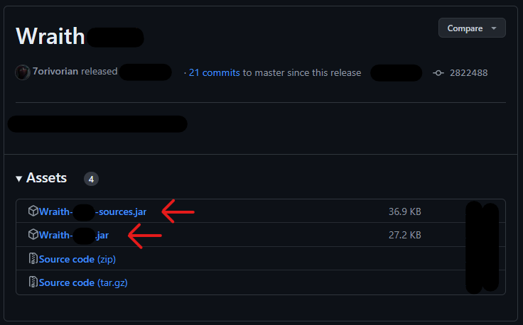

# Importing

=== "Maven"

    ```xml
    
    <dependency>
        <groupId>dev.7ori</groupId>
        <artifactId>wraith</artifactId>
        <version>4.1.0</version>
    </dependency>
    ```

=== "Gradle"

    ```groovy
    implementation group: 'dev.7ori', name: 'wraith', version: '4.1.0'
    ```

=== "Gradle (short)"

    ```groovy
    implementation 'dev.7ori:wraith:4.1.0'
    ```

=== "Gradle (Kotlin)"

    ```kts
    implementation("dev.7ori:wraith:4.1.0")
    ```

=== "sbt"

    ```sbt
    libraryDependencies += "dev.7ori" % "wraith" % "4.1.0"
    ```

=== "ivy"

    ```xml
    <dependency org="dev.7ori" name="wraith" rev="4.1.0"/>
    ```

=== "leiningen"

    ```clj
    [dev.7ori/wraith "4.1.0"]
    ```

=== "Jar"

    Wraith and its sources can be downloaded from 
    [GitHub](https://github.com/7orivorian/Wraith/releases/latest).
    
